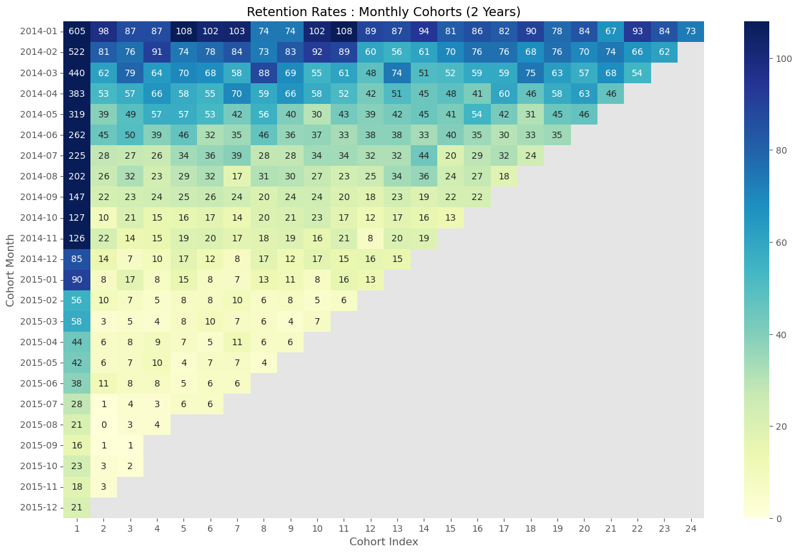

# Groceries : Cohort Analysis

This time i'll try to do some cohort analysis. I've just learned the subject :)

- Count of the most customers that came back is at 108. Where the Initial or day 1 is max at 605. Therefore its about 1/6 of the total.
- Where the average of churn is around 86%
- There is a day where the former customer does not back at all

