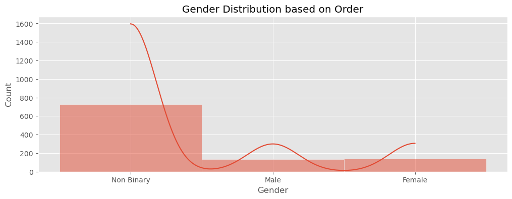

# Shopping Card : An Analytical Approach

## Insight

- From `orders.csv` we could acquire Delivery time, which shows the gaps on how long orders to be delivered
- Most orders are listed at month 3
- Most orders has to wait on 14-15 days to be delivered

- Most Customers are Non-Binary with most bought by them are Jacket

- Product with most revenue are product number 78 which is Shirt by Flannel

- Flannel Products has Revenue at 3102 (highest) in type of Shirts

- Even though Flannel has most revenue, turns out flannel was not most ordered items
